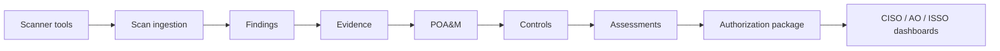

# Policy Forge

**Security-led, evidence-backed compliance automation for regulated cloud environments.**

Policy Forge helps security, compliance, and cloud engineering teams continuously connect findings, evidence, POA&Ms, controls, assessments, and authorization packages without slowing remediation.

## Executive Summary

Policy Forge is built for environments where security outcomes matter more than checkbox compliance. Engineers remediate first. Compliance attests asynchronously. Evidence is immutable. POA&Ms trace to real findings. Dashboards are backed by real source data. Authorization packages are assembled from auditable records, not recreated during audit season.

The result is a shared operating model for CISOs, Authorizing Officials, ISSOs, assessors, and cloud engineers: fix risk quickly, preserve proof automatically, and keep authorization decisions tied to current posture.

## Why CISOs Care

- Continuous visibility into control posture.
- Evidence-backed compliance, not slideware.
- Traceability from scan finding to POA&M to control to authorization package.
- Reduced audit scramble.
- Support for cloud engineers and compliance staff in the same workflow.
- Designed for RMF, NIST-style control environments, and regulated cloud operations.

## Security First, Compliance With Proof

Policy Forge does not make engineers wait for compliance approval before fixing risk. Engineers fix security issues quickly; compliance records, validates, attests, and packages the evidence.

Compliance is essential to the operating model. Policy Forge keeps it tied to source records so compliance can prove what happened, who reviewed it, and why risk decisions are defensible.

## Core Capabilities

- Scan ingestion
- Finding deduplication
- Control mapping
- POA&M generation
- Evidence management
- Assessment workflows
- SSP support
- Authorization package assembly
- Waivers and risk acceptances
- Continuous monitoring
- Control history and regression visibility
- AI-assisted workflow support, with human review

## Trust Model

Policy Forge is designed around records that can be inspected, traced, and challenged.

- Evidence is immutable after capture.
- Audit history is immutable and append-only.
- Dashboard calculations are explainable.
- Compliance status changes are never silent.
- Every executive tile drills down to source records.
- AI assists analysts and engineers, but does not become the system of record.

## Public Repository Disclaimer

This public repository is a product, architecture, documentation, and demo repository. It does not contain the proprietary Policy Forge application source code or deployment secrets.

## Architecture Overview

## Example Workflows

- A cloud engineer fixes a critical finding, attaches remediation evidence, and links the change to the originating scan.
- An ISSO validates remediation, records attestation, and updates control posture without blocking the fix.
- An assessor reviews evidence, traceability, and control history from source records.
- An AO receives an authorization package assembled from current, auditable artifacts.
- A CISO sees continuous posture with drill-down from executive tiles to findings, evidence, POA&Ms, and controls.

## Demo Data

The example files in this repository are synthetic and safe for public demonstration:

- Sample scans
- Sample findings
- Sample POA&M records
- Sample evidence manifests
- Sample control history
- Sample authorization package manifests

The samples use placeholders such as `acme-regulated-cloud`, `aws-account-000000000000`, `AC-2`, and `PF-DEMO-001`.

## Roadmap

Near-term roadmap themes:

- Stronger control history
- Regression alerts
- Richer authorization package export
- Improved AI assistance
- Air-gapped LLM integration
- Deeper scanner integrations
- Executive drill-down views

Policy Forge is for teams that want compliance to prove, preserve, and accelerate security work.
