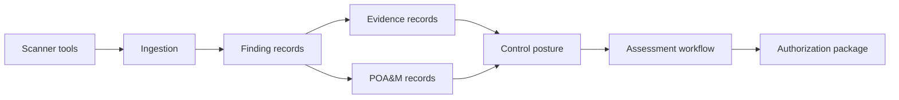

# Architecture Overview

Policy Forge organizes compliance around source-backed security records.

At a high level, scanner outputs flow into scan ingestion. Findings are normalized, deduplicated, mapped to controls, and connected to remediation evidence. POA&Ms, waivers, risk acceptances, assessments, and authorization package materials are derived from those auditable records.

This document is intentionally public-safe. It describes product architecture concepts without implementation code, deployment internals, secrets, or sensitive logic.
